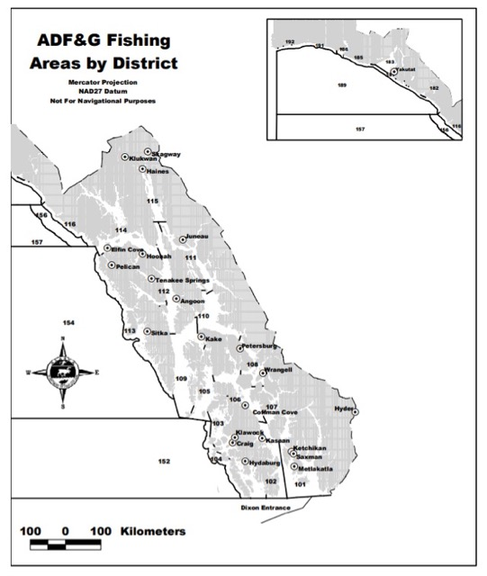
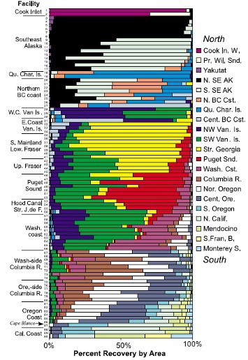

```{r}
library(data.table)
library(tidyverse)
library(ggpubr)
library(RColorBrewer)
library(grid)
library(gridExtra)
library(readxl)
library(patchwork)
```

```{r source SEAK scripts with functions}
source("R/harvest_and_value_byspecies.R")
source("R/region1_catchbyarea.R")
source("R/catch_statweek.R")

```

```{r read in all data}
skeena.sx.trtc<-fread("data-raw/sockeye/sockeye-skeena-trtc data.csv")
nass.sx.trtc<-fread("data-raw/sockeye/sockeye-nass-trtc data.csv")

harvests<-fread("data-raw/SEAK_catch/SEAK D101-D106 harvest by district by week.csv")

catch <- read.csv("data-raw/SEAK_catch/Alaska Statewide Salmon Landings by Area and Species 1985-present Fish Tickets.csv")

value <- read.csv("data-raw/SEAK_catch/ADFG AK Harvest and Vaue 1980 2022.csv")

bluesheet <- read.csv("data-raw/SEAK_catch/Alaska Statewide Salmon Landings by Area and Species 1985-present Fish Tickets.csv")

```

# Summary

# Southeast Alaska Catch of BC Salmon

@fig-seak-map shows Southeast Alaskan fisheries management areas. Note the location of the District 104 (Noyes and Dall Island) and District 101 (Tree Point) areas.

```{r fig-seak-map}
#| label: fig-seak-map
#| fig-cap: "Map of Southeast Alaska Fishing Areas by District."
#| out-width: "70%"


```

Total catch of all species in SEAK commercial fisheries has ranged from ~70 million to ~260 million between 1985 and 2024 (@fig-harvest-species). Pink salmon dominate catch numbers. Chum and sockeye are the second most caught, followed by coho and finally Chinook salmon.

```{r fig-harvest-species, fig.height=5, fig.cap="Southeast Alaska, US (SEAK) total harvest in millions of fish by species for each year for 1979-2021."}
make.harvest.byspecies(catch)
```

@fig-seak-value shows the harvest and harvest value of all salmon species in SEAK from 1979-2023. Chum salmon catch increased dramatically in the early 1990s. Catches of Chinook and coho salmon are trending down in recent years. Pink salmon catch is highly variable, with a discernable odd year/even year pattern (odd years being higher). Sockeye catches peaked in the mid-90s and have trended down since. Value is influenced by both the number of fish caught and the price per pound in any given year. Chum salmon now contribute the most value in SEAK fisheries.

```{r fig-seak-value, fig.height=10, fig.cap= "Southeast Alaska, US (SEAK) harvest (millions of fish) and value (millions of US Dollars) by species from 1985-2023."}
make.harvest.value.byspecies(value, catch)
```

@fig-catch-statweek shows the catch of Chinook, pink and sockeye salmon from Southeast Alaska districts 101, 102, 103, 104, and 106 in 2023, for seines and gillnets.

Note that the pattern of harvest is similar to that in other years, with sockeye harvest peaking in the D104 fishery slightly before the peak in pink harvest. In 2023, pink harvest was highest in D104 and D102, with the vast majority of sockeye harvest from D104.

Chinook was non-retention in the purse seine fisheries through almost all of 2023, however in one day of opening ~ 6,000 Chinook were kept in D104.

```{r fig-catch-statweek, fig.height=6, fig.cap="Harvest by species, gear type, district, and statistical week."}
make.catch.statweek.plot(harvests)
```

# Sockeye

```{r source sockeye scripts}
source("R/sockeye/sockeye_catch_bydistrict.R")
source("R/sockeye/sockeye_marine_catch_plots.R")
source("R/sockeye/sockeye_prop_week31.R")
source("R/sockeye/sockeye_er_sa.R")
source("R/sockeye/sockeye_ers_area5.R")
source("R/sockeye/sockeye_stockcomp_d101104.R")
source("R/sockeye/sockeye_fr_catch.R")
source("R/sockeye/sockeye_fr_stockcomps.R")

source("R/sockeye/skeena-sockeye-trtc-cu-akers.R")
source("R/sockeye/nass-sockeye-trtc-cu-akers.R")
```

```{r read sockeye data}
sk_harv <- read.csv("data-raw/SEAK_catch/SEAK D101-D106 harvest by district by week.csv") 

pre.sn<-read.csv("data-raw/D104 pre 31 versus total.csv", check.names = FALSE)  

sn<-read.csv("data-raw/skeena nass ak fishery ers.csv",header=TRUE,
             check.names = FALSE)

sa.data<-read.csv("data-raw/NCConlystatareadata.csv")

data<-read.csv("data-raw/2022-01-10d101.104GSI2006_2018.csv")

regions<-read.csv("data-raw/CatchByRegion2023.csv") 

stockgroups <- read.csv("data-raw/D104_AnnualCatchByStockGroup.csv", check.names=FALSE) 

```

Total sockeye catches (all gears) in Districts 101 and 106 have declined since the 90s, total catch in Districts 102, 103, and 105 have remained low and District 104 total catch peaked in the 90s and declined to an average of ~ 225,000 since, with catches ranging from near 0 to almost 800,000 (@fig-sx-catch-bydistrict).

```{r fig-sx-catch-bydistrict, fig.height=6, fig.cap="Total catch of sockeye salmon by year for SSEAK Districts 101-106 (1985-2023). Smoothed lines are derived by LOESS with standard errors shown in grey."}
make.catch.bydistrict(sk_harv)
```

The following set of figures describe the commercial marine catch of Skeena and Nass sockeye in South Southeast Alaska (SSEAK) and BC, with specific information on the proportion of catch between regions and trends over time. We also provide a more detailed summary of information on specific fisheries in SSEAK (e.g. with focus on District 104 and the Noyes and Dall Island fishing areas). Data source is provided in each figure.

US and Canadian commercial catch have declined since the 1990s for both Skeena (@fig-sk-marine-catch) and Nass (@fig-nass-marine-catch) sockeye.

```{r fig-sk-marine-catch, fig.height=5, fig.cap="Canadian and US Skeena sockeye harvest (1960-2023)."}
make.sk.marine.catch.plot(skeena.sx.trtc)
```

```{r fig-nass-marine-catch, fig.height=5, fig.cap="Canadian and US Nass sockeye harvest (1980-2023)."}
make.nass.marine.catch.plot(nass.sx.trtc)
```

Chapter 2 of the Pacific Salmon Treaty contains a clause that limits harvest of sockeye prior to Statistical Week 31 (end of July) in the District 104 seine fishery. The proportion of catch prior to Week 31 out of the total District 104 sockeye catch is shown for Skeena (@fig-pre-sk) and Nass (@fig-pre-nass) sockeye. Although variable, the proportion of sockeye harvested before Week 31 has declined for Nass sockeye, and was very low in 2019 and 2020 for Skeena sockeye. This could be an indication of later timed runs to the Skeena and Nass.

```{r fig-pre-sk, fig.height=5, fig.cap="Proportion of total D104 catch harvested before Week 31 for Skeena sockeye salmon."}
make.prop.week31.sk(pre.sn)
```

```{r fig-pre-nass, fig.height=5, fig.cap = "Proportion of total D104 catch harvested before Week 31 for Nass sockeye salmon."}
make.prop.week31.nass(pre.sn)
```

SEAK sub-area exploitation rate distributions over all years on Skeena and Nass sockeye are shown in @fig-ers-subarea.

Notably, the Noyes and Dall (District 104) fisheries have the most significant impact on Skeena sockeye, followed by the Tree Point (District 101) and Lower Clarence (southern District 102) fisheries.

For Nass sockeye, the Tree Point fishery has the most significant impact, followed by the Noyes, Dall, and Lower Clarence fisheries. This highlights the different migration routes of Skeena and Nass fisheries, where Nass sockeye are much more susceptible to harvest in District 101.

```{r fig-ers-subarea, fig.height=6, fig.cap="SEAK exploitation rate on Skeena and Nass sockeye by SEAK fishing sub-area."}
make.ers.sub.area(sn)
```

@fig-ers-area5 shows the Canadian and Alaskan exploitation rates of Area 5 sockeye salmon. Estimated Canadian ERs averaged around 15% in the 60s-80s, peaked in the 90s at around 30% and have since declined dramatically to between 0 and 8% in the last 10 years. Alaskan ERs have remained relatively constant between 0 and 5%.

```{r fig-ers-area5, fig.height=5, fig.cap="Canadian and SEAK exploitation rates on Area 5 sockeye, 1960 to 2017."}
make.ers.area5(sa.data)
```

The PSC Northern Fund final reports provide stock composition estimates by regional reporting groups based on genetic analyses of fisheries samples. We extracted stock composition data for District 101 commercial gillnet fishery and the District 104 commercial purse seine fisheries from the three most recent years available (Guthrie et al. 2018, 2019a, 2019b). Weekly stock compositions are shown in @fig-stockcomp. 
While Skeena and Nass (and Alaska) sockeye dominated catches in these 3 years in both fisheries, there was a small portion of catch attributed to the South Migrating reporting group separate from Fraser River sockeye. It is important to note that the reporting groups were condensed in fishery year 2016, so that those reports previous to 2016 showed a greater resolution of south migrating stocks and showed Central Coast BC and Queen Charlotte Island reporting groups (Guthrie et al. 2010, 2011, 2012, 2013, 2014, 2015a, 2015b, 2016, 2017). While these reporting groups were only present in fisheries in small proportions, sample size and power to detect low abundance populations may have been an issue. 
In summary, BC sockeye from areas other than the Fraser, Skeena and Nass Rivers are likely present in these fisheries in most years.

```{r fig-stockcomp, fig.height=8, fig.cap="Weekly stock composition of sockeye in the District 101 commercial gillnet and 104 commercial purse seine fisheries for 2016-2018. Estimates are based on genetic stock ID."}
make.stockcomp.d101104(data)
```

Information on Alaskan interceptions of Fraser sockeye by Canadian, Washington and Alaskan fisheries from 2000-2022 were provided by the Pacific Salmon Commission (PSC 2021a) and DFO (Les Jantz and Jamie Scroggie, personal communication, 2021). Additional information at the Conservation Unit/Stock level was provided in Latham and Samarasin (2018), which is a draft report summarizing the results of genetic analysis using Single Nucleotide Polymorphisms (SNPs) from sockeye samples collected during the 2018 fishing season from Alaskan District 104 seine fisheries.

Alaskan catch of Fraser sockeye averaged ~ 60,000 from 2000 to 2020 (@fig-catch-byregion, top panel). Canadian catch averaged ~ 2.2 million and Washington catch averaged ~ 320,000 over the same period. However, due to the cyclic nature of Fraser sockeye catch, average catch may not be an appropriate indicator of each fishery’s relative impact in a given year.
Alaskan exploitation is typically estimated to be very low (< 5%), with only 2 years 10% or higher (@fig-catch-byregion, middle panel).
The percent of total Fraser sockeye catch attributed to Alaskan fisheries is typically low, however there are a number of years where the proportion of Alaskan catch has been near to or much greater than the Canadian proportion (@fig-catch-byregion, bottom panel). This can likely be attributed to abundance-based management in PSC Fraser Panel waters, where in low abundance years Washington and BC fisheries targeting Fraser sockeye would be severely curtailed, whereas Alaskan fisheries are independent of Fraser sockeye abundance.
In 2018, Alaskan catch of Fraser sockeye was estimated to be ~ 53,000 (PSC 2021). Of this, Shuswap Lake sockeye dominated the catch (57%), followed by Quesnel (22%) and Chilko (13%) sockeye (Latham and Samarasin 2018).

```{r fig-catch-byregion, fig.height=8, fig.cap="Canadian (green), Alaskan (red) and Washington (green) catch (top panel), exploitation rate (middle panel) and percent of catch (bottom panel) for Fraser River sockeye from 2000-2022."}
make.fr.catch.plot(regions)
```

@fig-fr-stockcomps shows the stock composition of Fraser River sockeye catch by Conservation Unit between 2000 and 2021.

```{r fig-fr-stockcomps, fig.height=6, fig.cap="Stock composition by Conservation Unit for Fraser sockeye catch from 2000-2021."}
make.stockcomp.fr(stockgroups)
```

## Skeena
-   Alaskan fisheries catch all species of salmon in the Skeena
-   Catch of Skeena sockeye is estimated through the Northern Boundary Run Reconstruction Model and can be very high in some years, especially on late timed populations

Information on Alaskan exploitation of Skeena sockeye comes primarily from the Northern Boundary Sockeye Run Reconstruction model, which uses estimated run-timing and migration route to provide estimates of interception rates in Alaska fisheries. We show time-series of Alaskan exploitation rates for each Skeena sockeye Conservation Unit with information (@fig-skeena-trtc1) and the distribution of exploitation rates (@fig-skeena-trtc2).

```{r fig-skeena-trtc1, fig.height=10,fig.cap="Alaskan exploitation rates for each Skeena sockeye Conservation Unit (1960-2023)."}

make.skeena.trtc.lineplot(skeena.sx.trtc)

```

```{r fig-skeena-trtc2,fig.height=8,fig.cap="Distribution of Alaskan exploitation rates on each Skeena sockeye CU with information (1960-2023)."}

make.skeena.trtc.boxplot(skeena.sx.trtc)

```

## Nass
Information on Alaskan exploitation of Nass sockeye comes primarily from the Northern Boundary Sockeye Run Reconstruction model, which uses estimated run-timing and migration route to provide estimates of interception rates in Alaska fisheries. We show timeseries of Alaskan exploitation rates for each Nass sockeye Conservation Unit with information (@fig-nass-trtc1) and the distribution of exploitation rates by CU (@fig-nass-trtc2).

```{r fig-nass-trtc1,fig.height=5,fig.cap="Alaskan exploitation on Nass sockeye by CU."}

make.nass.trtc.lineplot(nass.sx.trtc)
```

```{r fig-nass-trtc2,fig.cap="Distribution of Alaskan exploitation rates on each Nass sockeye CU with information (1960-2023)."}

make.nass.trtc.boxplot(nass.sx.trtc)
```

ADFG “Blue Sheet” harvest data for SEAK commercial fisheries was requested and provided from ADFG for 1979-2024.
@fig-sk-bs-fishery shows the harvest of sockeye salmon by SEAK fishery for 1979-2024. Sockeye salmon are primarily caught in the Bristol Bay, Alaska Peninsula/Aleutian Islands, Cook Inlet, and Kodiak fisheries, as well as Prince William Sound, Southeast/Yakutat, and Chignik fisheries. 

```{r fig-sk-bs-fishery, fig.height=8, fig.cap= "Southeast Alaska, US (SEAK) harvest of Sockeye by fishery between 1980 and 2024. Note that the y-axis scales are scaled by individual facet."}
make.sockeye.bluesheet(bluesheet)
```

# Chinook 
```{r source chinook scripts}
source("R/chinook/chinook_bluesheet_catch.R")
source("R/chinook/chinook_catch_bydistrict.R")
source("R/chinook/chinook_exploitation_sa.R")
source("R/chinook/chinook_er_cu.R")
source("R/chinook/chinook_seak_er_ctc.R")
```

```{r read chinook data}
data <-read.csv("data-raw/2021-12-12_1980-2020 SE Harvest BY Fishery_LONG.csv", check.names = FALSE)

districts<-read.csv("data-raw/SEAK harvest by district 85-21.csv", check.names = FALSE)

sa.data<-fread("data-raw/NCConlystatareadata.csv")

seak_er<-fread("data-raw/NC_TRTC_2019_04_04.txt")

cn_new <- fread("data-raw/chinook/cn_all_mort_new2025.csv")

```

Chinook salmon catch in SEAK is historically dominated by power troll traditional (60%) and spring (11%) fisheries, with smaller contributions (< 25,000 median catch) from other fisheries (e.g., southern purse seine, hatchery cost recovery, etc.) (@fig-cn-boxplot). Median catch from 1980-2021 in the southern purse seine fisheries is just under 10,000, but in some years can be much higher (20-30,000). The total 2021 catch in Southern Purse Seine fisheries was 6,836 (ADFG 2021c), lower than the median catch at the ~ 35th percentile of all years.

```{r fig-cn-boxplot, fig.height=6, fig.cap="Distribution of total Chinook salmon commercial catch in SEAK Blue Sheet fisheries from 1980-2021."}
make.cn.blusheet.box(data)
```

Total catches (all gears) in District 104 is highly variable but has declined substantially since around 2000 (@fig-cn-catch-bydistrict). The last few years have seen relatively low catches at less than or around 20,000. District 101 catch has remained relatively constant since increasing in the 90s. Catch in District 104 was higher than in the last 4 years in 2021.

```{r fig-cn-catch-bydistrict, fig.height=6, fig.cap = "Total catch of Chinook salmon by year for SSEAK Districts 101-106 (1985-2021). Smoothed lines are derived by LOESS with standard errors shown in grey."}
make.cn.districts.plot(districts)
```

Canadian and SEAK exploitation rates for north and central coast BC Chinook Areas with data are shown in @fig-cn-er-statarea. Area 9S refers to Area 9 Summer Chinook, and Area 9W refers to Wannock Chinook. Canadian exploitation rates have been variable, but in general have remained relatively constant (Areas 3, 6, 9W, and 9S), increased (Area 8) or decreased (Area 10). There is little recent data for Area 10, and Area 8 ERs are likely driven by catch of enhanced Atnarko River Chinook. SEAK ERs have increased (9W and 9S), averaged about the same (Areas 3, 4, and 6), or decreased (Areas 8 and 10) over time. Area 4 ERs were historically the highest, averaging around ~40-50%, dropped in the late 90s and in recent years have averaged between 10 and 20%. SEAK ERs range from near 0 to close to 40% in some Areas (Area 9W and 9S in recent years).

```{r fig-cn-er-statarea, fig.height=8, fig.cap="SEAK (red) and Canadian (blue) exploitation rates by year for north and central coast (Statistical Areas 1-10) Chinook salmon from 1985-2017. Source: LGL 2021a."}
make.cn.ers.plot(sa.data)
```

@fig-cn-er-cu shows SEAK ERs over time by CU for Skeena, Central Coast, and Nass CUs. There is some variation in trends between CUs, however following Area specific SEAK ERs, there are substantial increases in SEAK ERs in recent years in Rivers Inlet and Wannock Chinook CUs. In Skeena CUs, SEAK ER has declined slightly in Lower Skeena and Middle Skeena (large lakes and mainstem tributaries) CUs, while it has remained relatively steady in the Kalum, Ecstall, and Upper Bulkley CUs. 

```{r fig-cn-er-cu, fig.height=8, fig.cap="SEAK exploitation rates for Chinook salmon from north and central coast Conservation Units from 1954-2017. Trend lines derived using LOESS in R. Source: PSF 2021."}

make.cn.er.cu(seak_er)
```

@fig-cn-seak-ctc shows total SEAK ERs by year for Canadian CTC Chinook indicator stocks (excluding Transboundary systems). Total SEAK ERs have trended lower in recent years for most stocks, with the exception of Puntledge River, which increased slightly in the 2000s and has remained relatively stable since. Note that the Phillips and Middle Shuswap stocks have short time series (< 10 years).

```{r fig-cn-seak-ctc, fig.height=8, fig.cap="Total SEAK exploitation rates for Canadian (excluding Transboundary stocks) CTC indicator stocks by year (1979-2023). Trend lines derived using LOESS in R. Source: PSC CTC 2025."}
make.cn.seak.ctc(cn_new)
```

@fig-cn-bs-fishery shows the harvest of Chinook salmon by "Blue Sheet" fishery for 1979-2024. Chinook salmon are primarily caught in the Southeast/Yakutat, Bristol Bay, Yukon, and Kuskokwim fisheries although catch declined significantly in the Yukon and Kuskokwim fisheries since 2010. Chinook are also caught in the Alaska Peninsula/Aleutian Islands, Kodiak, Prince William Sound, Cook Inlet, and Chignik fisheries.

```{r fig-cn-bs-fishery, fig.height=8, fig.cap= "Southeast Alaska, US (SEAK) harvest of Chinook by fishery between 1980 and 2024. Note that the y-axis scales are scaled by individual facet."}
make.chinook.bluesheet(bluesheet)
```

# Coho
```{r source coho scripts}
source("R/coho/coho_seak_cdn_ers.R")
source("R/coho/coho-seak-er-cu.R")
source("R/coho/coho_zolzap_ers.R")
```

```{r coho data}
data<-fread("data-raw/NC_TRTC_2019_04_04.txt")
zz<-fread("data-raw/zolzap ers.csv")

```

Canadian and SEAK exploitation rates for north and central coast BC coho are shown by Statistical Unit in @fig-co-ers. In Areas 5-10, Canadian exploitation rates have dropped dramatically in the late 90s following decreased marine survival and the coho crisis which severely curtailed most fisheries. For Areas 2E, 2W, and 3, Canadian ERs dropped in the late 90s, but appear to be close to historical levels in some recent years (~20%). Area 4 ERs were historically the highest, averaging around ~40-50%, dropped in the late 90s and in recent years have averaged between 10 and 20%.

SEAK ERs are estimated to be highest for Area 3 coho production (averaging around 30-40% with some years over 50%), slightly lower in Area 4 and Area 6 (same ER as Area 4), and much lower for the rest of the areas. SEAK ERs on Haida Gwaii (Areas 2E and 2W) are very low,
averaging around 2-4%.

```{r fig-co-ers, fig.height=8, fig.cap = "SEAK (red) and Canadian (blue) exploitation rates by year for north and central coast (Statistical Areas 1-10) coho salmon from 1954-2017. Source: LGL 2021a."}
make.co.ers.plot(sa.data)
```

@fig-co-seak-er-cu shows SEAK ERs over time by CU for north and central coast CUs. There is some variation in trends between CUs, but CUs show stable, slightly increasing, or slightly decreasing SEAK ERs in recent years.
SEAK ERs for north and central coast CUs follow the same patterns as their respective indicator estimates, therefore the proportion of catch attributed to SEAK fisheries is high for Skeena and Nass CUs, and moderate for central coast CUs. This means that these estimates suggest that SEAK catch has been higher in recent years than Canadian catch, and some times by 3-fold (Nass).

```{r fig-co-seak-er-cu, fig.height=8, fig.cap="SEAK exploitation rates for coho salmon from north and central coast Conservation Units from 1954- 2017. Trend lines derived using LOESS in R. Source: PSF 2021."}
make.co.seak.ers(data)
```

Information on Canadian and SEAK catch specifically of Zolzap Creek coho for 1992-2005 and 2010- 2018 was provided by LGL (2021b) and in a draft report (Noble et al. 2020). This is similar to the Area 3 data as the Zolzap system is the indicator system for the Area 3 (Nass). This was the only system level data we were able to procure before the writing of this report. SEAK ERs range from over 60% to less than 20%, but average around 40% over the time series, much higher than Canadian ERs (@fig-co-zz-ers). The proportion of total ER attributed to SEAK ranges from ~ 60% in 2018 to 100% in 1997, but averages around 75%.

```{r fig-co-zz-ers, fig.height=6, fig.cap ="CDN (blue) and SEAK (red) exploitation rates (above) and the percent of SEAK harvest (below) for Zolzap Creek coho. Source: LGL 2021b, Noble et al. 2020."}
make.co.zz.plot(zz)
```

Weitkamp and Neely (2011) provide an excellent analysis of ocean migration patterns from CWT recoveries of hatchery and wild coho from Alaska to California. @fig-coho-recovery (Figure 2 from Weitkamp and Neely 2011), provides an overview of the recovery patterns for tagged coho. Key findings of this analysis are that north BC coast CWT coho are recovered in approximately equal numbers in north and south SEAK fisheries and north BC coast and Haida Gwaii fisheries. There are no central coast hatcheries. Haida Gwaii origin fish are mostly recovered in north BC and Haida Gwaii, and there are very few recoveries of WCVI, ECVI, south mainland, lower or upper Fraser coho in SEAK. This provides support for both the high SEAK ERs in north coast coho, and the low SEAK ERs for southern stocks. Weitkamp and Neely (2011) also determine that CWT’d tagged wild coho follow relatively similar patterns of marine distribution as their specific regional hatchery indicators, suggesting that SEAK ERs would be similar for wild coho as hatchery indicators.

```{r fig-coho-recovery}
#| label: fig-coho-recovery
#| fig-cap: "Recovery patterns of coded-wire tagged coho salmon (Oncorhynchus kisutch) by hatchery. Each bar provides the percent of recoveries in the 21 recovery areas for a single hatchery. The geographic region of hatcheries is indicated. Source: Weitkamp and Neely (2011)."
#| out-width: "70%"



```

@fig-co-bs-fishery shows the harvest of coho salmon by "Blue Sheet" fishery for 1979-2024. Coho salmon are primarily caught in the Southeast/Yakutat, Alaska Peninsula/Aleutian Islands, Prince William Sound, Kodiak, and Cook Inlet fisheries, as well as in smaller numbers in the Bristol Bay, Koskokwim, Chignik, Norton Sound/Port Clarence, and Yukon fisheries.

```{r fig-co-bs-fishery, fig.height=8, fig.cap= "Southeast Alaska, US (SEAK) harvest of Coho by fishery between 1980 and 2024. Note that the y-axis scales are scaled by individual facet."}
make.coho.bluesheet(bluesheet)
```

# Chum

```{r source chum scripts}
source("R/chum/chum_seak_harvest.R")
source("R/chum/chum_seak_bydistrict.R")
source("R/chum/chum_seak_cdn_ers_sa.R")
source("R/chum/chum_seak_er_bycu.R")
```

```{r chum data}
harv<-fread("data-raw/SEAK_catch/ADFG AK Harvest and Vaue 1980 2022.csv")
data<-fread("data-raw/SEAK harvest by district 85-21.csv")
er_cu<-fread("data-raw/NC_TRTC_2019_04_04.txt")
```

Total chum salmon catch in SEAK between 1980 and 2022 ramped up in the early 90s following investments in large scale enhancement in Alaska, has averaged nearly 10 million since (@fig-chum-seakharv). Since 2010, catches have averaged just under ~ 10 million chum per year. Total SEAK catch of chum in 2022 was over 15 million chum, a substantial jump from recent averages.

```{r fig-chum-seakharv, fig.height=6, fig.cap="Total SEAK harvest (millions of fish) of chum salmon from 1980-2022."}
make.chum.harv.plot(harv)
```

Total catches (all gears) in District 101 is highly variable and since 2000 has ranged from ~ 100,000 to nearly 2 million (@fig-chum-seak-district). The last few years have seen relatively low catches. The District 104 fishery has remained relatively constant and low since the 2000s.

```{r fig-chum-seak-district, fig.height=6, fig.cap="Total catch of chum salmon by year for SSEAK Districts 101-106 (1985-2021). Smoothed lines are derived by LOESS with standard errors shown in grey. Source: ADFG 2021d."}
make.chum.harv.bydist(data)
```

SSEAK and Canadian exploitation rates for north and central coast BC chum salmon are shown in @fig-chum-ers-sa. Exploitation rates from SSEAK are only estimated for Areas 3, 4 and 5. Canadian exploitation rates are highly variable and have recently declined to much lower levels than in the historical time period in most Areas (except Area 9 and 10 where recent estimates are not available), and especially in Areas 3, 4 and 5. Following pink salmon exploitation rates, estimated SSEAK exploitation rates on chum salmon have declined slightly since the 80s, but in the last 20 years have averaged around 12% in Areas 3,4 and 5.
```{r fig-chum-ers-sa, fig.height=8, fig.cap="SEAK (red) and Canadian (blue) exploitation rates by year for north and central coast (Statistical Areas 1-10) chum salmon from 1954-2017. Source: PSF 2021."}
make.chum.ers.sa(sa.data)
```

@fig-chum-seak-er-cu shows SEAK and Canadian exploitation rates for north and central coast BC chum salmon by Conservation Unit. Across all CUs, Canadian ER has declined drastically since the 1990s while SEAK ER has also declined slightly.

```{r fig-chum-seak-er-cu, fig.height=8, fig.cap="Canadian and SEAK exploitation rates for chum salmon from north and central coast Conservation Units from 1954- 2017. Trend lines derived using LOESS in R. Source: PSF 2021."}
chum.seak.er.cu(er_cu)
```

@fig-cm-bs-fishery shows the harvest of chum salmon by "Blue Sheet" fishery for 1985-2024. Chum salmon are primarily caught in the Southeast/Yakutat, Prince William Sound, Alaska Peninsula/Aleutian Islands, and Bristol Bay fisheries, as well as the Kodiak, Yukon, Cook Inlet, Kuskokwim, Chignik, and Arctic/Kotzebue fisheries.

```{r fig-cm-bs-fishery, fig.height=8, fig.cap= "Southeast Alaska, US (SEAK) harvest of Chum by fishery between 1980 and 2024. Note that the y-axis scales are scaled by individual facet."}
make.chum.bluesheet(bluesheet)
```

# Pink
```{r source pink scripts}
source("R/pink/pink_seak_harv.R")
source("R/pink/pink_seak_harv_dist.R")
source("R/pink/pinkeven_ers_sa.R")
source("R/pink/pinkodd_ers_sa.R")
source("R/pink/pink_seak_er_cu.R")
```

```{r pink data}
data<-fread("data-raw/SEAK harvest by district 85-21.csv")

```

Total pink salmon catch in SEAK between 1979 and 2021 peaked in the mid-90s, averaging ~ 37 million (@fig-pink-seak-harv). Since 2010, catches have averaged ~ 32.5 million.
```{r fig-pink-seak-harv, fig.height=6, fig.cap="SEAK catch (millions of fish) of pink salmon from 1979-2021. Source: ADFG 2021a (1979-2020), ADFG 2021b (2021)."}
make.pink.harv(harv)
```

Total catches (all gears) in District 104 in most years has declined since the 90s to an average catch of around 5 million per year in the 2000s (@fig-pink-seak-harv-dist). The other Districts have remained variable with no major trends over time.
```{r fig-pink-seak-harv-dist, fig.height=6, fig.cap="Total catch of pink salmon by year for SSEAK Districts 101-106 (1985-2021). Smoothed lines are derived by LOESS with standard errors shown in grey. Source: ADFG 2021d."}
pink.seak.harv.bydistrict(data)
```

SSEAK and Canadian exploitation rates for north and central coast BC even year pink salmon are shown in @fig-pink-ers-sa. Exploitation rates from SSEAK are only estimated for Areas 3, 4 and 5. Canadian exploitation rates have declined to much lower levels than in historical time period in all Areas (except Area 9 and 10 where recent estimates are not available). SSEAK exploitation rates have declined slightly since the 80s, but in the last 20 years have averaged around 12% in Areas 3,4 and 5.
```{r fig-pink-ers-sa, fig.height=8, fig.cap="SSEAK (red) and Canadian (blue) exploitation rates by year for north and central coast (Statistical Areas 1-10) even-year pink salmon from 1954-2017. Source: PSF 2021."}
make.pink.ers.sa(sa.data)
```

SSEAK and Canadian exploitation rates for north and central coast BC odd year pink salmon are shown in @fig-pinkodd-ers-sa. Exploitation rates from SSEAK are only estimated for Areas 3, 4 and 5. Similar to even year pink salmon, Canadian exploitation rates have declined to much lower levels than in historical time period in all Areas (except Area 9 and 10 where recent estimates are not available). SSEAK exploitation rates have declined slightly since the 80s, but in the last 20 years have averaged around 10% in Areas 3,4 and 5.
```{r fig-pinkodd-ers-sa, fig.height=8, fig.cap="SSEAK (red) and Canadian (blue) exploitation rates by year for north and central coast (Statistical Areas 1-10) odd-year pink salmon from 1954-2017. Source: PSF 2021."}
make.pink.odd.ers.sa(sa.data)
```

SSEAK exploitation rates are shown for north and central coast CUs by year for even and odd year pink salmon in @fig-pink-seak-er-cu. Similar to the Area specific exploitation rates these are estimated from, SSEAK exploitation rates decline starting around 1990 in most CUs. Recent year CUs range from ~ 10-15% for most CUs, and ~ 2.5% for the even-year Hecate Lowlands and odd-year Hecate Strait-Lowlands CUs.
```{r fig-pink-seak-er-cu, fig.height=8, fig.cap="SSEAK exploitation rates for even (red points) and odd (blue points) year pink salmon from north and central coast Conservation Units from 1954-2017. Trend lines derived using LOESS in R. Source: PSF 2021."}
pink.seak.er.cu(er_cu)
```

@fig-pk-bs-fishery shows the harvest of pink salmon by "Blue Sheet" fishery for 1979-2024. Pink salmon are primarily caught in the Southeast/Yakutat, Prince William Sound, Kodiak, and Alaska Peninsula/Aleutian Islands fisheries, as well as Cook Inlet and Chignik fisheries, and a very small number in Bristol Bay. 
```{r fig-pk-bs-fishery, fig.height=8, fig.cap= "Southeast Alaska, US (SEAK) harvest of Pink Salmon by fishery between 1980 and 2024. Note that the y-axis scales are scaled by individual facet."}
make.pink.bluesheet(bluesheet)
```


# Transboundary
```{r read TBR data}
d106 <- read_excel("data-raw/TBR/TBR data_updated2023.xlsx", sheet="TBR.106.harvest")
d108 <- read_excel("data-raw/TBR/TBR data_updated2023.xlsx", sheet="TBR.106.harvest")
d111 <- read_excel("data-raw/TBR/TBR data_updated2023.xlsx", sheet="TBR.D111harvest")

stikine.cn<-read_excel("data-raw/TBR/TBR data_updated2023.xlsx", sheet="TBR.stikine.chinook.rr")

data<-read_excel("data-raw/TBR/TBR data_updated2023.xlsx",sheet="TBR.stikine.cn.d108.catch")
data3<-read_excel("data-raw/TBR/TBR data_updated2023.xlsx",sheet="TBR.stikine.cn.d108.prop")

taku_cn<-read_excel("data-raw/TBR/TBR data_updated2023.xlsx",sheet="TBR.D5.Taku.Lchinook")

taku.co<-read_excel("data-raw/TBR/TBR data_updated2023.xlsx",sheet="TBR.D20.Taku.CO")

d111.sx<-read_excel("data-raw/TBR/TBR data_updated2023.xlsx",sheet="TBR.D111.sx.catch")

taku.sx<-read_excel("data-raw/TBR/TBR data_updated2023.xlsx",sheet="TBR.D15.Taku.SX")

alsek<-read_excel("data-raw/TBR/TBR data_updated2023.xlsx",sheet="TBR.ALSEK.chinook")

alsek.sx<-read_excel("data-raw/TBR/TBR data_updated2023.xlsx",sheet="TBR.ALSEK.sockeye")

catch<-read_excel("data-raw/TBR/TBR data_updated2023.xlsx",sheet="TBR.ALSEK.co.pk.cm.catch")

cn<-fread("data-raw/chinook/cn_all_mort_updated.csv")

stikine.sx<-read_excel("data-raw/TBR/TBR data_updated2023.xlsx",sheet="TBR.stikine.river")

```

```{r source TBR scripts}
source("R/TBR_106_108_catch.R")
source("R/TBR_111_gncatch.R")
source("R/TBR_stikine_chinook.R")
source("R/TBR_stikine_cn_catch.R")
source("R/TBR_taku_cn_rr.R")
source("R/TBR_taku_co_rr.R")
source("R/TBR_taku_sx_byfishery.R")
source("R/TBR_taku_sx_rr.R")
source("R/TBR_alsek_cn_catch.R")
source("R/TBR_alsek_tr_ers.R")
source("R/TBR_alsek_cn_catchprop.R")
source("R/TBR_alsek_sx_catch.R")
source("R/TBR_alsek_sx_catchprop.R")
source("R/TBR_alsek_co_pk_cm_catch.R")
source("R/TBR_stikine_sx.R")
source("R/TBR_total_er_cn.R")
```

```{r fig-tbr-106108-catch, fig.height=6, fig.cap="SEAK catch of all salmon species in Districts 106 and 108, 1960-2023."}
make.tbr.106108.catch(d106, d108)
```

```{r fig-tbr-111-gncatch, fig.height=6, fig.cap="SEAK commercial gillnet catch of all salmon species in District 111, 1960-2023."}
make.tbr.d111.gncatch(d111)
```

```{r fig-stikine-chinook, fig.height=8, fig.cap="Stikine River Chinook salmon Canadian harvest, US harvest, and escapement (top panel), Canadian vs US harvest (middle panel), and Canadian and US percent of total harvest (bottom panel), 1996-2023."}
make.stikine.cn.plot(stikine.cn)
```

```{r fig-stikine-cn-catch, fig.height=8, fig.cap="Stikine River District 108 Chinook salmon US catch and stock proportion by fishery, 2005-2023."}
make.stikine.cn.catch(data, data3)
```

```{r fig-taku-cn-rr, fig.height=8, fig.cap = "Taku River Chinook salmon Canadian harvest, US harvest, and escapement (top panel), Canadian vs US harvest (middle panel), and Canadian and US percent of total harvest (bottom panel), 1988-2023."}
make.taku.cn.rr(taku_cn)
```

```{r fig-taku-co-rr, fig.height=8, fig.cap="Taku River Coho salmon Canadian harvest, US harvest, and escapement (top panel), Canadian vs US harvest (middle panel), and Canadian and US percent of total harvest (bottom panel), 1992-2023."}
make.taku.co.rr(taku_co)
```

```{r fig-taku-sx-fishery, fig.height=6, fig.cap="Taku River Sockeye salmon catch in District 111 by fishery, 1967-2023."}
make.taku.sx.fishery(d111.sx)
```

```{r fig-taku-sx-rr, fig.height=8, fig.cap="Taku River sockeye salmon Canadian harvest, US harvest, and escapement (top panel), Canadian vs US harvest (middle panel), and Canadian and US percent of total harvest (bottom panel), 1984-2023."}
make.taku.sx.rr(taku.sx)
```

```{r fig-alsek-cn-catch, fig.height=6, fig.cap="Canadian and US catch of Alsek River Chinook salmon by fishery, 1960-2023."}
make.alsek.cn.catch(alsek)
```

```{r fig-alsek-cn-tr-ers, fig.height=6, fig.cap="Terminal run (top panel) and Canadian and US exploitation rates (bottom panel) for Alsek River Chinook salmon, 1998-2004."}
make.alsek.cn.tr.ers(alsek)
```

```{r fig-alsek-cn-catchprop, fig.height=8, fig.cap="Alsek River Chinook salmon Canadian harvest, US harvest, and escapement (top panel), Canadian vs US harvest (middle panel), and Canadian and US percent of total harvest (bottom panel), 1975-2023."}
make.alsek.cn.catch(alsek)
```

```{r fig-alsek-sx-catch, fig.height=6, fig.cap = "Canadian and US catch of Alsek River Sockeye salmon by fishery, 1960-2023."}
make.alsek.sx.catch(alsek.sx)
```

```{r fig-alsek-sx-catchprop, fig.height=8, fig.cap="Alsek River Sockeye salmon Canadian harvest, US harvest, and escapement (top panel), Canadian vs US harvest (middle panel), and Canadian and US percent of total harvest (bottom panel), 1960-2023."}
make.alsek.sx.catchprop(alsek.sx)
```

```{r fig-alsek-co-pk-cm, fig.height=8, fig.cap="US catch, effort, and CPUE for Alsek River Coho, Pink, and Chum Salmon, 1960-2023."}
make.co.pk.cm.catch(catch)
```

```{r fig-stikine-sx, fig.height=8, fig.cap="Stikine River Sockeye salmon Canadian harvest, US harvest, and escapement (top panel), Canadian vs US harvest (middle panel), and Canadian and US percent of total harvest (bottom panel), 1979-2023."}
make.stikine.sk.plot(stikine.sx)
```

```{r fig-total-er-cn, fig.height=6, fig.cap="Canadian and US total exploitation rate for Taku and Stikine Chinook salmon, 1979-2019"}
make.total.er.cn(cn)
```

# Steelhead
To be added.

# Appendix 1: Pacific Salmon Commission Chinook Technical Committee Mortality Distribution Tables
